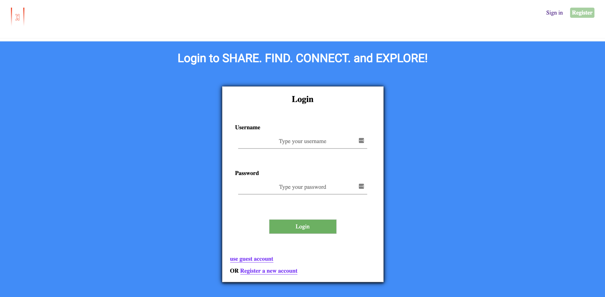
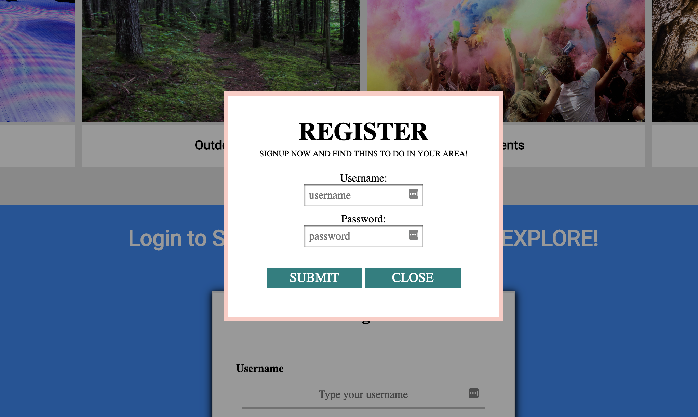
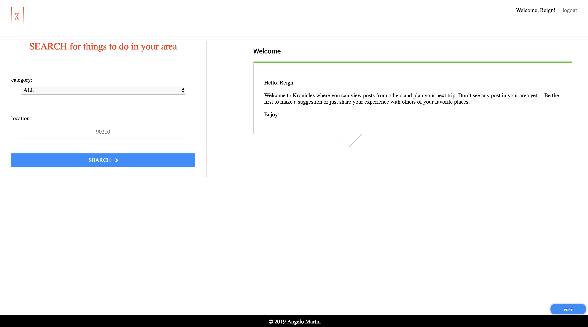
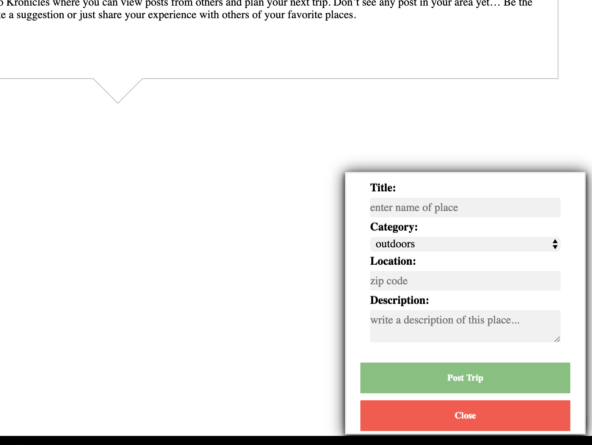

Kronicles
==========

Link to [Live App](https://agile-fortress-59590.herokuapp.com)

Summary
---------------------

Traveling out of town, or taking a road trip isn’t always an option, Kronicles tries to bridge that gap by allowing people to share those hiding gems in town. Kronicles also allows people search what others have been up to base on your specified zip code. Kronicles will always list things in chronological order – this takes the guess work out and keeps you updated

### Landing page

* Form the landing page you have the option of clicking sign in or register a new account. Note that you can also scroll down to reveal the sign in page.

### Sign In Page

* Provide your username and password to Login. You can use a generic guest account by using the "use guest account" link. From here you also have the option to register, by creating your own username and password. This can be done by clicking "Register a new account" or clicking "Register" in the top right corner.

### Register

* Create a new account by providing a unique username and password. 

### Logged In Page

* Once you have logged in, you can now share you experiences by clicking “POST” or search what others are up to by selecting the category and specifying the zip code.

### Post you own experiences

* You can share you experiences by clicking “POST”, which will present you with a form. Fill in the necessary fields and click "Post Trip".

Technologies Used
---------------------

Here is a list of Technologies / languages used to bring Kronicles to life

*  HTML

*  CSS

*  Javascript

*  jQuery

*  Node.js

*  MongoDB

*  Mongoose

*  mLab

*  Mocha

* Chai

* Chai-http

* TravisCI

API Documentation
---------------------

### Root URL

1. URL

    https://agile-fortress-59590.herokuapp.com/

2. Method:

    GET

6. Success Response

    Code 200

7. Error Response:
    
    Code: 404 Not Found

### User Signin

1. URL

    /auth/login

2. Method:

    POST

3. Data Params

    {   "username":"",
        "password":""
    }

4. Success Response:

    Code: 200 
    Content: { id : 12 }

5. Error Response:

    Code: 401 Unauthorized
    Content: { error : "Unauthorized" }

### Post a trip

1. URL

    /trip-report

2. Method:

    POST

3. Data Params

    {
        title: "string", 
        postalCode: "string", 
        content: "string", 
        category: "string", 
        isPublished: boolean
    }

4. Success Response:

    Code: 200 Ok
    Code: 201 Created

### Edit a trip

1. URL

    /trip-report/:id

2. Method:

    PUT

3. URL Params

    Required:

    id=[integer]

5. Data Params

    {
        title: "string", 
        postalCode: "string", 
        content: "string", 
        category: "string", 
        isPublished: boolean,
        __v: 0,
        _id: "string"
    }

6. Success Response:

    Code: 200 

### Delete a trip

1. URL

    /trip-report/:id

2. Method:

    DELETE

3. URL Params

    Required:

    id=[integer]

6. Success Response:

    Code: 200